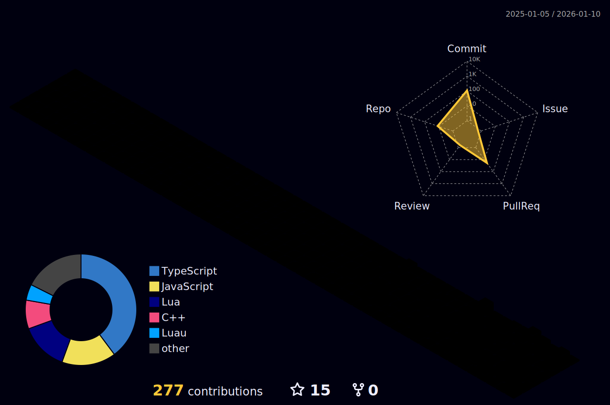

<div align="center">


# 👋 Welcome to 0xXrer's Digital Workspace

### `0xXrer`

**`low-level > high-level`** | **`aesthetics > functionality`** | **`rust | c | ts`**

```
🔧 engineer @ almaty, kz
🔍 reverse · obfuscation · kernels · bots · ui libs
```

**🚀 Currently working on:** Building a microkernel architecture & advanced obfuscation systems

[](https://discord.com/users/1287660832133611520)
[](https://t.me/ImXrer)

</div>

---

## 💻 Technology Stack

### `// stack`

```rust
let tech = vec![
    ("low_level", vec!["C", "C++", "Rust", "ASM"]),
    ("systems", vec!["Kernels", "Drivers", "Memory"]),
    ("web", vec!["TypeScript", "JavaScript"]),
    ("tools", vec!["Python", "Lua", "Luau"]),
    ("focus", vec!["Reverse Engineering", "Obfuscation", "Cryptography"]),
];
```

### 🛠️ Languages & Tools

<div align="center">

#### Core Languages


#### Web Technologies


#### Scripting & Automation


#### Tools & Platforms


</div>

---

## 📊 GitHub Statistics

<div align="center">


</div>

### 🎨 Most Used Languages

<div align="center">


</div>

### 📈 Contribution Activity

<div align="center">


</div>

### 🏆 GitHub Profile Trophy

<div align="center">


</div>

### 🎯 3D Contribution Graph

<div align="center">



</div>

---

## 🚀 Current Projects & Focus

### `// current`

```typescript
const projects = {
    active: [
        "🔧 microkernel architecture",
        "🔐 obfuscator for lua/luau",
        "🔍 reverse engineering toolkit",
        "🎨 ui component library"
    ],
    learning: ["🔒 advanced cryptography", "⚡ low-level optimization"],
    philosophy: "simple > complex, efficient > hacky, beautiful > working"
};
```

### 💡 Areas of Expertise

<div align="center">

```
┌─────────────────────────────────────────────────────────┐
│  🔍 Reverse Engineering    ██████████████████░░  90%    │
│  🔐 Obfuscation           ████████████████░░░░  85%    │
│  🔧 Kernel Development    ██████████████░░░░░░  80%    │
│  💾 Low-Level Systems     ████████████████████░  95%    │
│  🎨 UI Development        ████████████░░░░░░░░  70%    │
│  🔒 Cryptography          ██████████████░░░░░░  75%    │
└─────────────────────────────────────────────────────────┘
```

</div>

---

## 📫 Connect with Me

<div align="center">

### `// reach out`

[](https://discord.com/users/1287660832133611520)
[](https://t.me/ImXrer)
[](https://github.com/0xXrer)

**📧 Open for collaboration on low-level systems, reverse engineering, and creative UI projects**

</div>

---

<div align="center">

### `// philosophy`

**`perfectionist · minimalist · engineer`**

```
"The best code is the code you don't have to write"
```


---


</div>
