<!-- <h1 align="center">Hi 👋, I'm 0xXrer</h1> -->

  

 <table>
   <tr>
     <td rowspan=2>  </td>
     <td> 
	      
     </td>
   </tr>
   <tr>
	   <td></td> 
   </tr>
   <tr>
	   <td rowspan="2"></td> 
   </tr>
   <tr>
	   <td></td> 
   </tr>
 </table>

<!--
**0xXrer/0xXrer** is a ✨ _special_ ✨ repository because its `README.md` (this file) appears on your GitHub profile.

- 🔭 I'm currently working on: microkernel architecture & advanced obfuscation systems
- 🌱 I'm currently learning: advanced cryptography, low-level optimization
- 💬 Ask me about: reverse engineering, obfuscation, kernels, bots, ui libs
- 📫 How to reach me: Discord or Telegram @ImXrer
-->
